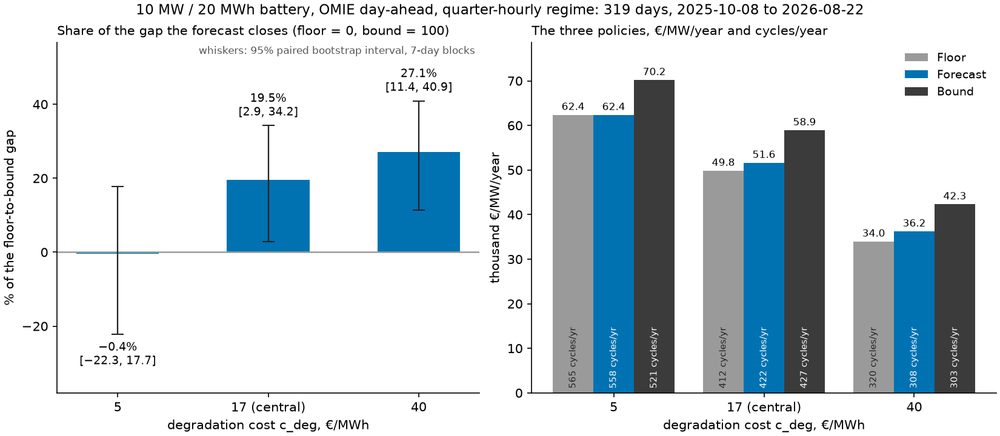

# Battery arbitrage in the Spanish day-ahead market

[](https://github.com/mrJGV/BESS_Arbitrage/actions/workflows/ci.yml)

<!-- toc -->
**Contents**

- [What was learned](#what-was-learned)
- [The result](#the-result)
  - [The hourly regime, as context](#the-hourly-regime-as-context)
- [The forecaster](#the-forecaster)
- [What this repository demonstrates](#what-this-repository-demonstrates)
- [What was tried and not adopted](#what-was-tried-and-not-adopted)
  - [Price-quantity bid curves](#price-quantity-bid-curves)
  - [Forecaster variants](#forecaster-variants)
- [Limitations](#limitations)
- [Quick start](#quick-start)
- [Repository layout](#repository-layout)
- [How this was built](#how-this-was-built)
- [Licence](#licence)

<!-- /toc -->

A **10 MW / 20 MWh** battery bids into the OMIE day-ahead auction. A rolling-horizon
Mixed-Integer Linear Program (MILP) decides its schedule against a price forecast
made before the auction closes, and the result is measured against two references
built with the same optimiser: a no-information floor and a perfect-foresight bound.
Everything runs from a clean clone on a free solver; the data snapshot is committed.

## What was learned

A 2-hour battery captures most of the day-ahead value from the calendar alone: a
floor that knows only the month and the time of day reaches 85% of perfect
foresight. A point forecast adds three points of that bound, and what it adds is
mostly which days to trade, so its value rises with the degradation cost. The money
left on the table is within-day shape, not the day's price level. Offered a
price-quantity bid curve instead of a fixed schedule, the optimiser bids the fixed
schedule.

## The result

Three policies, one optimiser, one difference between them: the price vector.

| Policy | Sees | Role |
|---|---|---|
| Floor | Hour-of-day × month average of every price published before the gate, since January 2022 | Lower reference |
| Forecast | LightGBM point forecast, gated at 12:00 CET on D−1 | The result |
| Bound | Realised prices | Upper reference |

Quarter-hourly regime, 319 delivery days from 8 October 2025 to 22 August 2026,
degradation cost `c_deg` = 17 €/MWh:

> Bidding the forecast earns **€51,615/MW/year**. The floor earns €49,842 and perfect
> foresight €58,916, so the forecast closes **19.5% of the gap between them**, with a
> 95% interval of 2.9% to 34.2%. The margin over the floor is distinguishable from
> zero at this degradation cost and above it, and not at the lowest one.



| `c_deg` €/MWh | Floor €/MW/yr | Forecast €/MW/yr | Bound €/MW/yr | % of bound, floor / forecast | Forecast's share of the gap, 95% interval | Cycles/yr, floor / forecast / bound |
|---|---|---|---|---|---|---|
| 5 | 62,385 | 62,356 | 70,184 | 88.9% / 88.8% | −0.4% (−22.3% to 17.7%) | 565 / 558 / 521 |
| **17** | **49,842** | **51,615** | **58,916** | **84.6% / 87.6%** | **19.5% (2.9% to 34.2%)** | **412 / 422 / 427** |
| 40 | 33,961 | 36,219 | 42,301 | 80.3% / 85.6% | 27.1% (11.4% to 40.9%) | 320 / 308 / 303 |

**The forecast, with respect to the floor and the bound.** The headline figure is the share of the gap, which puts the floor at 0 and the bound at 100 and measures only what the
forecast adds.

**The interval is a paired circular block bootstrap** over delivery days: every
resample draws the same days for all three policies, in 7-day blocks that wrap around
the run, 10,000 times. Blocks, because a day's profit depends on the days before it
through the state of charge carried over and through weather and fuel prices that
persist. At 14- and 28-day blocks the interval at `c_deg` = 17 is 5.6% to 32.6% and
7.8% to 29.7%. Four alternative LightGBM seeds put the share between 14.2% and 20.3%.
Per-day profits are in the committed summaries, so any of this can be recomputed
without a backtest.

**Where the remaining gap is.** Two diagnostic price vectors through the same
optimiser, both reading realised prices so neither is deployable: the forecast with
each day's mean replaced by the realised one reaches 90.5% of the bound; the realised
prices with each day's mean replaced by the forecast's reach 96.9%. Of the 12.4 points
between the forecast and the bound, knowing the day's level recovers 2.9 and knowing
its shape recovers 9.3. The forecaster's errors are about half common-mode across the
day (mean cross-period correlation 0.48), which is what makes a fixed schedule hard to
beat with a curve.

**The share rises with the degradation cost**, from −0.4% to 19.5% to 27.1%, and
does the same in the hourly regime. A linear degradation cost is a minimum spread every
trade must clear. The higher it is, the more the decision becomes which days to trade,
and the floor cannot tell one day in a month from another.

**Duration and tariff move the level, not the margin.** At 1, 2 and 4 hours the
forecast adds 3.5, 3.0 and 2.7 points over the floor, and a 4-hour battery captures
88% of its bound from the calendar. A network tariff of 5 or 15 €/MWh on charged
energy lowers every bar and leaves the forecast's margin over the floor at about
€2,000/MW/year.

**Cycles per year are plausible**: 422 for the forecast at the central `c_deg`, a
little over one a day for a 2-hour asset, so the degradation cost is in a sensible
range.

**The 48-hour horizon costs nothing.** The rolling oracle attains the annual-window
bound with the state of charge free across days, in both hourly and quarter-hourly
regimes, to the last bit of a float64: the rolling oracle's dispatch is feasible for
the annual problem, and the annual solve's dual bound says nothing better exists. The
whole gap between a policy and the bound is information, not horizon. Both solves are committed with solver, gap, wall
clock and machine: [results/annual_bound.json](results/annual_bound.json) (hourly,
8,784 binaries, 13.5 s) and
[results/annual_bound_quarter_hourly.json](results/annual_bound_quarter_hourly.json)
(31,296 binaries, 49.1 s). The quarter-hourly denominator is the dual bound, not the
incumbent, which stops €43.72 short of it.

### The hourly regime, as context

1,361 delivery days from 8 January 2022 to 29 September 2025. The level is not
comparable with the quarter-hourly regime, whose finer grid captures more spread, and
the forecast policy bids the floor's prices for its first year while the forecaster
waits for training history. With four times as many days the intervals are narrower.

| `c_deg` €/MWh | Floor €/MW/yr | Forecast €/MW/yr | Bound €/MW/yr | Forecast's share of the gap, 95% interval | Cycles/yr, floor / forecast / bound |
|---|---|---|---|---|---|
| 5 | 39,508 | 39,697 | 48,881 | 2.0% (−6.0% to 9.7%) | 519 / 505 / 492 |
| **17** | **27,460** | **28,545** | **38,161** | **10.1% (2.9% to 17.1%)** | **392 / 402 / 400** |
| 40 | 11,460 | 14,362 | 23,458 | 24.2% (17.1% to 31.2%) | 275 / 256 / 245 |

## The forecaster

Two LightGBM models per horizon day, trained only on rows published before the gate
and refitted as the run walks forward. The split is forced by the market: 15-minute
products started on 1 October 2025, so an hourly *level* model trains on everything
since 2022 while an intra-hour *deviation* model trains on the short 15-minute
history and predicts each quarter's departure from its own hour's mean. Each stage has
its own history threshold, and missing one is not the same as missing the other.
Without a year behind it the level model cannot be fitted and the policy bids the
floor's prices, which is what the hourly regime does for its first 368 decision days.
Without 30 days of 15-minute history the deviation model cannot be fitted and the day
is priced from the hourly level alone, which is what the headline run does for its
first 30 days, and where its early losses to the floor sit.
[DECISIONS.md §5](docs/DECISIONS.md#5-the-forecaster) has the features, the refit
cadence and the variants that were tested and dropped.

Accuracy is reported after the economics, because a better error score that does not
turn into captured spread is not an improvement. Lead 0, the forecast that priced
each evaluated day:

| Regime | Periods | RMSE €/MWh | MAE €/MWh | Bias €/MWh | Mean daily rank correlation |
|---|---|---|---|---|---|
| Quarter-hourly | 30,624 | 17.03 | 12.12 | −0.00 | 0.929 |
| Hourly | 23,999 | 21.48 | 15.99 | +7.86 | 0.918 |

The rank correlation is the line that matters: arbitrage uses the ordering of periods
within a day, not the level, and the ordering is about as good in both regimes. The
hourly model over-predicts in months when prices fell below anything in its training
history, early 2024 above all. Per-fit diagnostics are in the committed summaries.


## What this repository demonstrates

- **A MILP with its rationale next to it.** The formulation in
  [model/pyomo.py](src/bess_arb/model/pyomo.py) and
  [DECISIONS.md §3](docs/DECISIONS.md#3-physical-and-economic-model): why the
  binaries are needed under negative prices, why the big-M is the physical rating,
  why degradation is charged on discharge, and the golden case that any refactor has
  to reproduce.
- **An information gate enforced by tests.** Every feature carries
  the instant it was published, and
  [test_no_lookahead.py](tests/test_no_lookahead.py) checks it three ways: declared
  publication instants, perturbation of every price published after the gate, and
  negative controls that show each mechanism can still fail.
- **A floor and a bound that make the headline a testable claim.** Both are built
  by the same optimiser as the policy and differ from it only in the price vector ([backtest/bound.py](src/bess_arb/backtest/bound.py)),
  so the comparison measures information and nothing else. 
 
- **An interval on the headline**, from a paired circular block bootstrap
  ([backtest/compare.py](src/bess_arb/backtest/compare.py)), with the block length
  reported as a sensitivity.
- **Calendar handling that survives DST and the 15-minute market.** UTC storage,
  Europe/Madrid delivery days, 23- and 25-hour days derived rather than assumed
  ([timeline.py](src/bess_arb/timeline.py)).
- **A two-stage stochastic MILP for the bid curve**
  ([model/curve_pyomo.py](src/bess_arb/model/curve_pyomo.py)): the curve as a
  first-stage decision with per-scenario dispatch as recourse, and the measurement
  that says it buys nothing here.

## What was tried and not adopted

### Price-quantity bid curves

A real participant submits a price-quantity curve for each period. This project
commits a fixed schedule, which is the same as bidding at the market's price limits.
Four price-contingent bids were measured against it, the last two from a prototype
outside the shipped code that reproduces the shipped formulation at one band per
scenario to 1e-6. Forecast policy, quarter-hourly, `c_deg` = 17, over the 167
evaluated days from October 2025 to March 2026, a shorter window than the headline so
the level differs:

| Bidding | €/MW/yr | Against the fixed schedule |
|---|---|---|
| Fixed schedule | 33,711 | — |
| Curves built from joint scenarios of past forecast errors | 24,410 | −27.6% |
| Curve chosen by a two-stage stochastic MILP, one price band per scenario | 26,791 | −20.5% |
| The same MILP, 20 scenarios sharing 3 price bands | 33,548 | −0.5% |
| The same, with the scenario sample centred on the forecast | 33,683 | −0.1% |

- **A curve clears period by period, and a battery's dispatch is a trajectory.** A
  curve with several steps can clear into a sequence the state of charge cannot
  deliver; the scenario-built curves cleared energy equal to 82% of what the battery
  discharged that it could not deliver.
- **The stochastic MILP with one band per scenario overfits** each step to a single
  sampled day. With 20 scenarios sharing 3 bands the overfitting goes and the
  optimiser bids one quantity per period on the delivery day in all but a handful of
  periods. Centre the scenario sample on the forecast and it stops being a curve at
  all: on 129 of the 139 curve days it settles to the cent against the fixed schedule
  solved from the same state of charge, and the −0.1% above is the two paths
  separating on the ten days that differ.
- Every stage-2 instance solves at the root node; the curve model's cost grows with
  the root LP, not with branching.
- **Curves traced from the forecast's own quantiles** were the first construction
  tried and also lost. They were not re-run after the information set was corrected,
  so they carry no figure in the table above; see
  [DECISIONS.md §6](docs/DECISIONS.md#6-bid-curves-and-joint-scenarios).

### Forecaster variants

None of these beat the shipped forecaster, and all were scored on the same 319 days
the headline reports, so adopting the best of them would be selection on the
evaluation set. They are listed rather than adopted:

- a 730-day and a 365-day rolling training window and a 365-day half-life decay:
  the rolling windows lose 1.1 to 1.5 points of bound at every `c_deg`, the decay is
  within half a point with a paired interval a full point wide on either side;
- a second stage targeting each day's within-day shape: within half a point.


## Limitations

- **Day-ahead only.** Secondary reserve, balancing energy, the intraday auctions and
  the continuous intraday market are not modelled. Reserve would take headroom away
  from arbitrage; intraday trading would let the battery correct its position as
  forecasts improve, which cuts the cost of the forecast errors a fixed schedule pays
  in full here.

- **Price-taker.** 10 MW is assumed not to move the OMIE price. That stops holding
  for a fleet.
- **Publication times are assumed, not observed.** A day's prices are read as known
  from 13:00 local on the day before delivery, OMIE's usual publication hour. The
  snapshot carries no publication timestamps.
- **Under a year of the headline market.** 15-minute day-ahead products started on
  1 October 2025, so the headline sample is 319 days, which is why its intervals are
  wide.
- **A simple degradation and loss model.** Degradation is a linear cost on discharged
  energy, swept over 5, 17 and 40 €/MWh because published values span that range.
  Round-trip efficiency is a constant 85%, there is no calendar ageing, and the
  network tariff on charged energy is a parameter reported as a sensitivity.

## Quick start

```bash
uv sync
uv run pytest          # golden case, Δt-invariance, binary necessity, DST,
                       # snapshot integrity, no-lookahead — no network, no token

# Both regimes, three c_deg values, then the chart: under an hour on an
# 8-thread laptop. `make backtest figures` runs the same three commands.
uv run bess-arb run --regime quarter_hourly --sweep --json results/backtest_quarter_hourly.json
uv run bess-arb run --regime hourly --sweep --json results/backtest_hourly.json
uv run bess-arb figures

uv run bess-arb bound  # the annual-window bound, DECISIONS.md §2.4
```

The frozen data snapshot is committed, so a clone reproduces every result without an
API token. See [data/README.md](data/README.md) for provenance and
`data/manifest.json` for row counts and checksums. The backtest is deterministic:
repeated runs reproduce the committed summaries to the euro.

## Repository layout

```
config/params.yaml       every numeric parameter, plus backend/solver selection
data/                    frozen Parquet snapshot + manifest (provenance, sha256)
docs/DECISIONS.md        the modelling decisions and their rationale
hpc/                     cluster provision for larger tests
results/                 annual bounds, backtest summaries with per-day profit,
                         tariff sensitivities, and the headline chart
src/bess_arb/timeline.py UTC storage, Europe/Madrid delivery days, derived
                         periods-per-day, the 12:00 D−1 gate, publication instants
src/bess_arb/series.py   reading the frozen snapshot back, validated
src/bess_arb/model/      the MILP behind a pluggable backend Protocol, and the
                         two-stage bid-curve MILP
src/bess_arb/data/       one-shot ESIOS pull, OMIE cross-check, snapshot manifest
src/bess_arb/policy/     floor / forecast / oracle — price vectors, nothing more
src/bess_arb/forecast/   features stamped with the instant each became knowable,
                         and the LightGBM fit — the only place the library is imported
src/bess_arb/bid/        bid curves traced from forecast quantiles
src/bess_arb/scenarios.py joint price scenarios from each policy's past errors
src/bess_arb/backtest/   rolling-horizon loop, metrics, the annual bound, the
                         share of the gap and its bootstrap interval
src/bess_arb/figures.py  the headline chart, drawn from a backtest summary
tests/                   the gates: golden, Δt-invariance, binaries, DST,
                         snapshot integrity, floor causality, no-lookahead,
                         import boundary
```

## How this was built

This repository was written with Claude Code, and the commits carry a
`Co-Authored-By` trailer to record that. The modelling decisions are mine: the D−1
information gate, the binaries, the degradation cost, what counts as a fair bound and
floor, and what to conclude from the measurements. Every one of them is argued in
[docs/DECISIONS.md](docs/DECISIONS.md) next to the alternative it beat.

## Licence

[Apache License 2.0](LICENSE). Redistributions keep the [NOTICE](NOTICE) file,
which carries the attribution.

Price and forecast data are from [ESIOS](https://www.esios.ree.es/) (Red Eléctrica
de España) and [OMIE](https://www.omie.es/), and are redistributed here under their
own terms; the licence covers the code, not the data. See
[data/README.md](data/README.md) for provenance and attribution.
